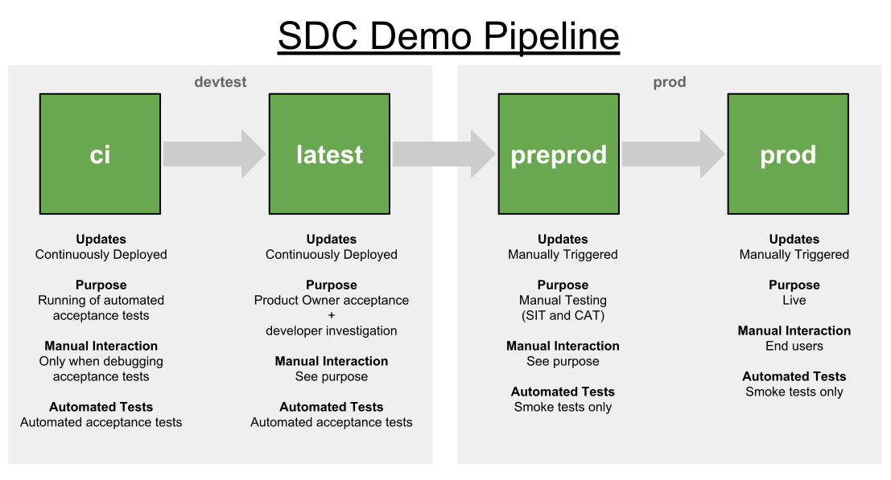

# Concourse Demo Pipeline

This is a demo Concourse pipeline developed by SDC. Its purpose is to
serve as a reference on how to develop pipelines which support the ways
in which SDC work.

## Overview

The pipeline promotes change through 4 environments, each with it own
intended purpose.

### Components

This pipeline is made up of the following:

- [A Java Microservice](https://github.com/ONSdigital/concourse-demo-java-service)
- [A Python Microservice](https://github.com/ONSdigital/concourse-demo-python-service)
- [The Acceptance Tests](https://github.com/ONSdigital/concourse-demo-acceptance-tests)
- This Pipeline Repository
- [The Deployment Trigger Repository](https://github.com/ONSdigital/concourse-demo-deploy-trigger)

## Process Requirements

Here are the process requirements that the pipeline had to meet and the
technical solutions that we came up with to satisfy them.

### Nothing is merged to `master` until it has been peer reviewed

Pull requests are required by the teams in order to moderate the code
quality of the services. All service level tests are run by TravisCI
before pull requests are merged. This happens before the Concourse
pipeline is triggered - which happens every time a merge is made to the
`master` branch.

### Automated acceptance tests are run on every merge to `master`

The acceptance tests run in the `ci` environment once all services have
been successfully built and deployed to the environment. These check
the functionality of the application as a whole.  Any failures should be
investigated and resolved as soon as possible so that the pipeline
doesn't block other work from being deployed.

### Only changed services are deployed

Concourse supports this natively, so this is one of the benefits of
using it.

### Deployment to `preprod` and `prod` is manually triggered

The reason we are using manual triggers for `preprod` and `prod` is to
allow for manual testing by preventing services being continuously
deployed to these environments.

This is achieved by using a
[trigger repo](https://github.com/ONSdigital/concourse-demo-deploy-trigger)
in Github.  The Concourse job is triggered when a user
pushes a commit to this repo. To prevent the jobs being started
manually via the Concourse UI, the manual trigger is disabled via the
`disable_manual_trigger` flag in the pipeline yml.

### A restricted group of users can deploy to `preprod` and `prod`

Access is limited by restricting who has permissions to commit to the
trigger repository.

Using a Github trigger repo allows all deployments to `preprod` and
`prod` to be audited.  The users that have access to run `preprod` and
`prod` deployments can be managed via permissions to push to the trigger
repo.

### Deployments to `preprod` and `prod` are audited

Running the shell script in the repository creates a blank file named
with the current date and time.  Github will show which user created the
file and therefore ran the release.

The commit history in the trigger repository serves as an audit trail of
all deployments to `preprod` and `prod`.

### All services deployed to `preprod` tag with a version number

Before a service is deployed to preprod, the current version is
incremented using semantic versioning. i.e. `1.0.1` becomes `1.0.2`.

This happens in the `release-*` jobs after the `preprod-trigger`.

In order to ensure that the correct commit is tagged, the pipeline has to
pass the service repository through the entire pipeline with `passed`
flag set in each job. **If this isn't done, then we risk tagging the wrong
commit.**

### Java services are deployed via the Artifactory repository

Java artifacts are required because Maven doesn't guarentee that the
dependencies will be identical each time is is run.

For Java services, an artifact is built in the first step of the
pipeline and pushed to Artifactory. This artifact is then used when
deploying to both the `ci` and `latest` environments.

In the `release-*` job, a copy of the artifact is then created with the
version number in the name, and then pushed to Artifactory. This is then
used for the deployments to `preprod` and `prod`.

### An environment can be setup with no manual interaction

This is currently not demonstated in this pipeline but should be achieved
by the following mechanisms:

1. Create all Cloud Foundry services (e.g. databases) as idempotent
   processes in the deployment job of every services which uses them.

1. Use database migrations in the services to ensure that the databases
   are updated to he required state.